<!-- ░░░ SNAKE — Hero, ganz oben über allem ░░░ -->

  <picture>
    <source media="(prefers-color-scheme: dark)" srcset="./assets/snake-dark.svg"/>
    <source media="(prefers-color-scheme: light)" srcset="./assets/snake.svg"/>
    
  </picture>

<!-- ░░░ TITEL ░░░ -->
<h1 align="center">🌌 MULTIVERSEMEDIA</h1>

<b>fl0w</b> &nbsp;·&nbsp; DevOps &amp; Cloud Architecture

  

  

---

## 🧬 Über mich

Hi, ich bin **fl0w** 👾 — Fullstack-Entwickler, DevOps-Ingenieur und **AWS Certified Solutions Architect** aus Athen.
Ich entwerfe und betreibe effiziente, skalierbare Cloud-Systeme: von Infrastructure-as-Code über CI/CD-Pipelines
bis zu containerisierten Microservices.

Unter dem Label **Multiversemedia** baue ich darüber hinaus **KI-Plattformen, autonome Multi-Agent-Systeme
und Automatisierungen** — von der Cloud-Infrastruktur bis zur Agenten-Logik. Mein Fokus: komplexe,
manuelle Prozesse in reproduzierbare, produktionsreife Produkte zu überführen. Ständiges Lernen ist mein Default-Branch.

---

## 🛠️ Tech-Stack

**☁️ Cloud & Plattformen**

**🏗️ Infrastructure as Code & Provisioning**

**🐳 Container, Orchestrierung & GitOps**

**⚙️ CI/CD**

**🧠 KI · LLM · Autonome Agenten**

**💻 Sprachen**

**🕸️ Backend, Frameworks & Frontend**

**🗄️ Datenbanken & Daten**

**🔭 Monitoring & Observability**

**⛓️ Web3 & Blockchain**

---

## ⚡ Aktivität

### 🧊 Contribution-Jahr in 3D

  

### 📈 Aktivitäts-Verlauf

  

---

## 🔥 Stats & Streak

  
  

### 🧮 Sprachen & Code

  

---

## 🧪 Woran ich arbeite — hinter der Fassade

> 🔒 Der Großteil entsteht in **privaten Repos & unter NDA**. Hier die *funktionale* Sicht auf die Produkte —
> ohne Kunden-, Marken- oder Plattformdaten, mit Fokus auf Technik, Architektur und Innovation.

### 🚀 KI-Plattform für Creator- & Content-Management
Eine vollständig automatisierte Plattform, die **Multi-Agent-KI**, **CRM** und **Content-Pipelines** verbindet:
LLM-orchestriertes Messaging, automatisierte Workflows, Analytics-Dashboards und **Deep-Research-Pipelines**.
End-to-end von der Infrastruktur bis zur Agenten-Logik konzipiert und betrieben — skalierbar und produktionsreif.

`Multi-Agent` · `LLM-Orchestrierung` · `CRM-Automation` · `Next.js` · `FastAPI` · `n8n` · `PostgreSQL`

### 🧠 Autonome Agenten & Automatisierung
Multi-Agent-Systeme (CrewAI / Eliza-Stack), n8n-Workflows und Deep-Research-Pipelines, die wiederkehrende
Wissens- und Content-Prozesse autonom abbilden — von Recherche über Generierung bis Ausspielung.

### 🎬 Media-Produktions-Automation
KI-gestützte **Transkription** und automatisierte **Content-Verarbeitung** von Video & Audio at scale —
Pipelines, die Rohmaterial in strukturierte, weiterverwertbare Assets verwandeln.

### 🛡️ Compliance & Datenschutz
Ein **DSGVO-Agent**, der Datenschutz-Prüfungen, Dokumentation und Audit-Vorbereitung automatisiert —
Compliance als Code statt manueller Checklisten.

### 🌐 Web-Plattformen & SaaS
Management-Dashboards, Agentur-Tooling und digitale Auftritte für **Praxen, Manufakturen & KMU** —
performant, wartbar und sauber deployed.

### ⛓️ Web3-Engineering
**Smart Contracts, Jettons & NFT-Systeme auf TON** — On-Chain-Logik und Tokenisierung,
seriös und sicherheitsbewusst umgesetzt.

### ☁️ Cloud & Platform Engineering
Das Fundament unter allem: **AWS-IaC**, CI/CD, Kubernetes und Observability — damit Produkte
zuverlässig, reproduzierbar und skalierbar laufen.

---

## 📂 Open Source & Public Repos

| Projekt | Beschreibung | Stack |
|---|---|---|
| 🎙️ [video-transcriber-ai](https://github.com/flow-84/video-transcriber-ai) | KI-gestützte Echtzeit-Transkription von Video- & Audio-Dateien | `TypeScript` `AI` |
| 🧭 [agencyflow](https://github.com/flow-84/agencyflow) | Agentur-Management-Tool (AgencyFlow by fl0w) | `JavaScript` |
| 🏗️ [terraform-sns-lambda-ddb](https://github.com/flow-84/terraform-sns-lambda-ddb) | AWS-Infrastruktur als Code: SNS → Lambda → DynamoDB | `Terraform` `AWS` |
| ⚙️ [GithubActions](https://github.com/flow-84/GithubActions) | CI/CD-Pipelines & Self-Hosted-Runner-Infrastruktur | `Docker` `Actions` |
| 🤖 [Jenkins](https://github.com/flow-84/Jenkins) | Vollständige CI/CD-Pipeline mit Jenkins | `Docker` `Jenkins` |
| 📊 [Prometheus](https://github.com/flow-84/Prometheus) · [Grafana](https://github.com/flow-84/Grafana) | Monitoring- & Alerting-Setup für Cloud-Workloads | `Prometheus` `Grafana` |

---

## 📜 Zertifizierungen & Weiterbildung

- 🏅 **AWS Certified Solutions Architect**
- 🐧 **Linux Essentials**
- ⛓️ **Blockchain** — HPI Certificate
- 🧠 **AI / LLM Engineering** — HPI Certificate
- 📚 Laufende autodidaktische Weiterbildung, Workshops & Communities

---

## 🏆 Trophäen

  

---

## 📡 Kontakt

  
  
  

🌌 <b>Multiversemedia</b> · gebaut mit Cloud, KI &amp; Neon · <code>fl0w</code>

