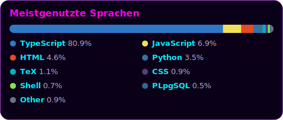

<!-- ░░░ HEADER ░░░ -->

  

  

  

---

## 🧬 Über mich

Hi, ich bin **fl0w** 👾 — Fullstack-Entwickler, DevOps-Ingenieur und **AWS Certified Solutions Architect** aus Athen.
Ich entwerfe und betreibe effiziente, skalierbare Cloud-Systeme: von Infrastructure-as-Code über CI/CD-Pipelines
bis zu containerisierten Microservices. Unter dem Label **Multiversemedia** baue ich außerdem KI-gestützte Tools
und Automatisierungen. Ständiges Lernen ist mein Default-Branch.

---

## 🛠️ Tech-Stack

**☁️ Cloud & Plattformen**

**🏗️ Infrastructure as Code**

**🐳 Container & Orchestrierung**

**⚙️ CI/CD**

**💻 Sprachen**

**🔭 Monitoring & Daten**

---

## ⚡ Aktivität

> Die Schlange frisst meinen Contribution-Graph — live aus meinen öffentlichen **und** privaten Beiträgen.

  <picture>
    <source media="(prefers-color-scheme: dark)" srcset="./assets/snake-dark.svg"/>
    <source media="(prefers-color-scheme: light)" srcset="./assets/snake.svg"/>
    
  </picture>

### 🧊 Contribution-Jahr in 3D

  

### 📈 Aktivitäts-Verlauf

  

---

## 🔥 Stats & Streak

  
  

### 🧮 Sprachen & Code

  

---

## 🏆 Trophäen

  

---

## 🚀 Projekt-Highlights

| Projekt | Beschreibung | Stack |
|---|---|---|
| 🎙️ [video-transcriber-ai](https://github.com/flow-84/video-transcriber-ai) | KI-gestützte Echtzeit-Transkription von Video- & Audio-Dateien | `TypeScript` `AI` |
| 🧭 [agencyflow](https://github.com/flow-84/agencyflow) | Eigenes Agentur-Management-Tool (AgencyFlow by fl0w) | `JavaScript` |
| 🏗️ [terraform-sns-lambda-ddb](https://github.com/flow-84/terraform-sns-lambda-ddb) | AWS-Infrastruktur als Code: SNS → Lambda → DynamoDB | `Terraform` `AWS` |
| ⚙️ [GithubActions](https://github.com/flow-84/GithubActions) | CI/CD-Pipelines & Self-Hosted-Runner-Infrastruktur | `Docker` `Actions` |
| 🤖 [Jenkins](https://github.com/flow-84/Jenkins) | Vollständige CI/CD-Pipeline mit Jenkins | `Docker` `Jenkins` |
| 📊 [Prometheus](https://github.com/flow-84/Prometheus) · [Grafana](https://github.com/flow-84/Grafana) | Monitoring- & Alerting-Setup für Cloud-Workloads | `Prometheus` `Grafana` |

---

## 📜 Zertifizierungen & Weiterbildung

- 🏅 **AWS Certified Solutions Architect**
- 🐧 **Linux Essentials**
- ⛓️ **Blockchain** — HPI Certificate
- 🧠 **AI / LLM Engineering** — HPI Certificate
- 📚 Laufende autodidaktische Weiterbildung, Workshops & Communities

---

## 📡 Kontakt

  
  
  

  

